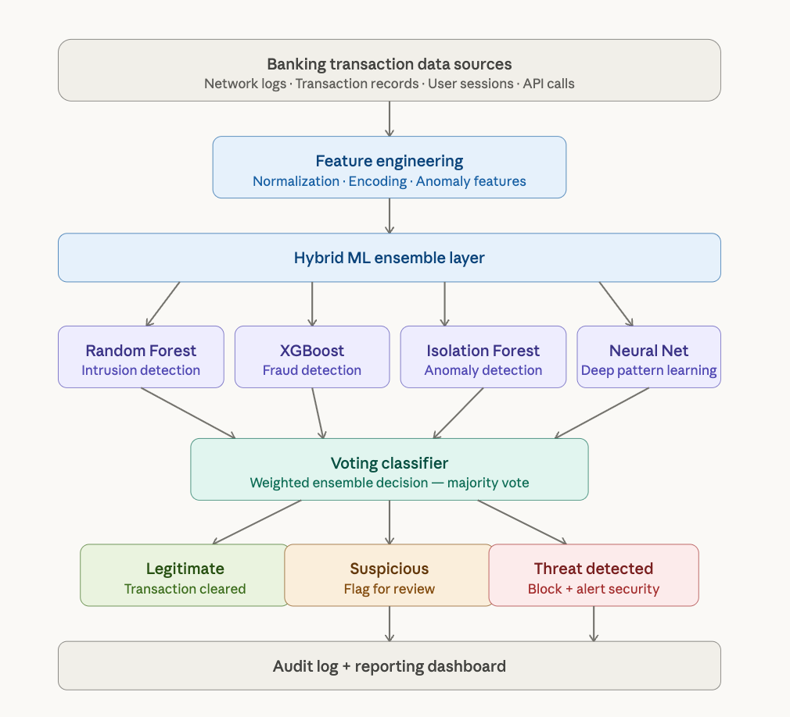

# 🛡️ Banking Cybersecurity ML System  
**Network Intrusion Detection & Log Anomaly Detection**  

## 📌 Project Overview  
This project implements a **world-class AI-powered cybersecurity system** specifically designed for the **banking and financial services sector**.  
It addresses two critical challenges:  
1. **Network Intrusion Detection** using **Random Forest + XGBoost (ensemble)**.  
2. **Log Anomaly Detection** using **Isolation Forest + LSTM (hybrid approach)**.  

The system was developed in **Google Colab** as part of the *AI in Finance* course (Final Project, Group 9), showcasing advanced skills in **machine learning, anomaly detection, and financial cybersecurity**.  

---

## System Architecture

The following diagram shows the full hybrid ML pipeline,
from raw banking data through the ensemble detection layer
to real-time threat classification and audit logging.

## 🎯 Objectives  
- Build a **modular, reproducible, and scalable** ML pipeline for financial environments.  
- Simulate **network attacks** and **log anomalies** in realistic banking scenarios.  
- Evaluate performance using solid metrics (**accuracy, recall, AUC**).  
- Ensure **compliance with legal, ethical, and regulatory frameworks**.  

---

## 🚀 Key Features & Results  
- ✅ **High accuracy (>95%)** in network intrusion detection.  
- ✅ Real-time anomaly detection in server logs.  
- ✅ Combination of **supervised + unsupervised learning methods**.  
- ✅ **Scalable pipeline** that adapts to changing data and financial contexts.  
- ✅ Designed with **explainability, reproducibility, and transparency** in mind.  

---

## 📊 Advantages in the Banking Sector  
- 🔹 Strengthens **fraud detection** and **network defense** simultaneously.  
- 🔹 Uses **ensemble & hybrid models** (Random Forest, XGBoost, Isolation Forest, LSTM).  
- 🔹 Flexible architecture: new models or rules can be added easily.  
- 🔹 Adapts to **economic, cultural, and customer behavior shifts** via retraining.  
- 🔹 Promotes **human-in-the-loop monitoring**, ensuring ethical and transparent use of AI.  

---

## ⚖️ Legal, Ethical & Regulatory Considerations  
- Complies with **GDPR, PCI-DSS, FFIEC**, and other banking regulations.  
- Emphasizes **AI explainability and accountability** in decision-making.  
- Guarantees **traceability** in case of audits or legal disputes.  
- Addresses **social and psychological trust factors** critical in banking.  

---

## 🔍 Comparison with Similar Projects  
- **Traditional banking fraud systems**: focus mainly on transaction-level fraud.  
- **Previous intrusion detection projects**: often use outdated supervised-only approaches.  
- **This project’s unique contribution**:  
  - Combines **network intrusion detection + log anomaly monitoring** in one unified system.  
  - Hybrid ensemble of **classic ML + deep learning (LSTM)**.  
  - Designed for **real-world banking deployments** with scalability and compliance.  

---

## 📝 Academic Context  
- **Course:** AI in Finance  
- **Project:** Final Project 1 (Executive/Technical Report + Code)  
- **Students:** Inmaculada Concepción Rondon & Iván Darío Amarillo Lozada  
- **Professors:** Andrés Mauricio Alzate Virviescas (Lead) & Oscar Fernández (Tutor)  
- **Date:** September 18, 2025  

---

## 📂 Repository Contents  
- `cybersecurity_system_for_Banking_and_Financial_services.ipynb` → Full Colab notebook (code, experiments, results).  
- `Banking_Cybersecurity_Report.pdf` → Executive/technical report (3–4 pages).  
- `Banking_Cybersecurity_Report.docx` → Same report in Word format.  
- `README.md` → Project overview (this document).  

---

## 👩‍💻 About the Author  
**Inmaculada (Mackie) Rondon**  
- 🎓 Master’s in Artificial Intelligence, Universidad de los Andes.  
- 💼 Founder & Innovation Strategist | AI & Sustainable Supply Chain Expert.  
- 🌍 Bilingual (English/Spanish), experienced in AI for finance, supply chain optimization, and cybersecurity.  
- 🔗 [LinkedIn Profile](https://www.linkedin.com/in/mackie-rondon-53364b33)  

---

## 📌 How This Adds to My Portfolio  
This project highlights my ability to:  
- Combine **AI/ML research with financial sector applications**.  
- Deliver **end-to-end pipelines** from data preprocessing to deployment-ready models.  
- Produce both **technical code** and **executive-level documentation**.  
- Bridge **AI innovation, compliance, and real-world banking challenges**.  

---

📌 *Este README es profesional, en inglés, estilo portfolio GitHub.  
By uploading your notebook and the PDF to your repo, GitHub will display this README on the main page, giving it both an executive and technical look at the same time.*
